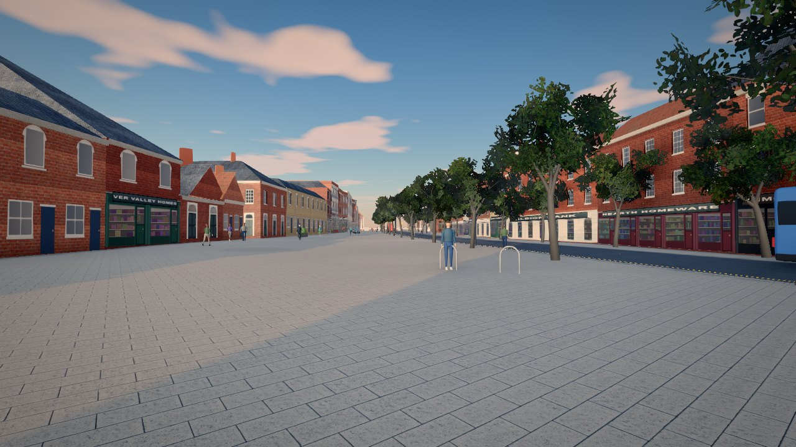
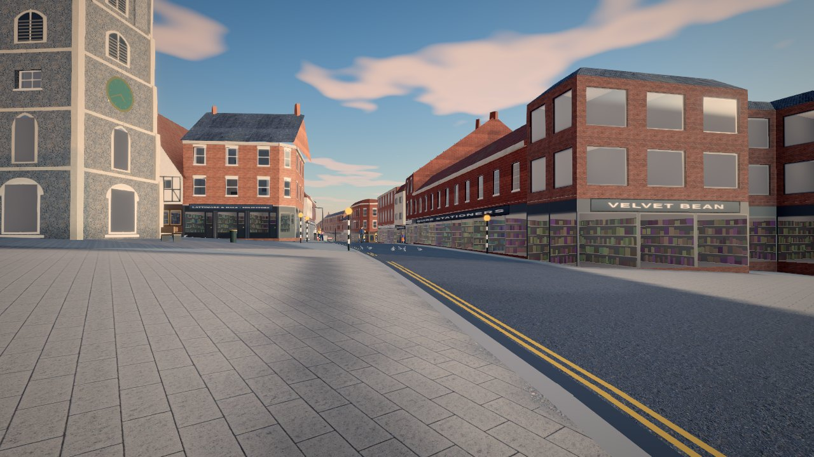
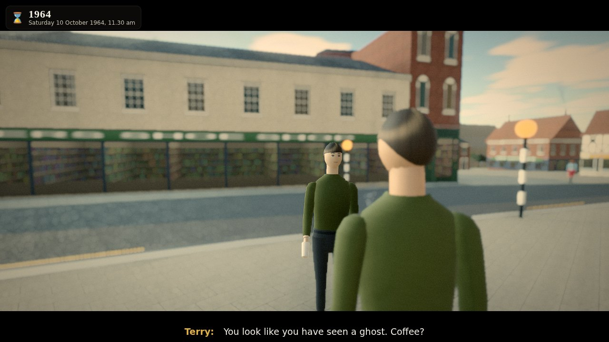
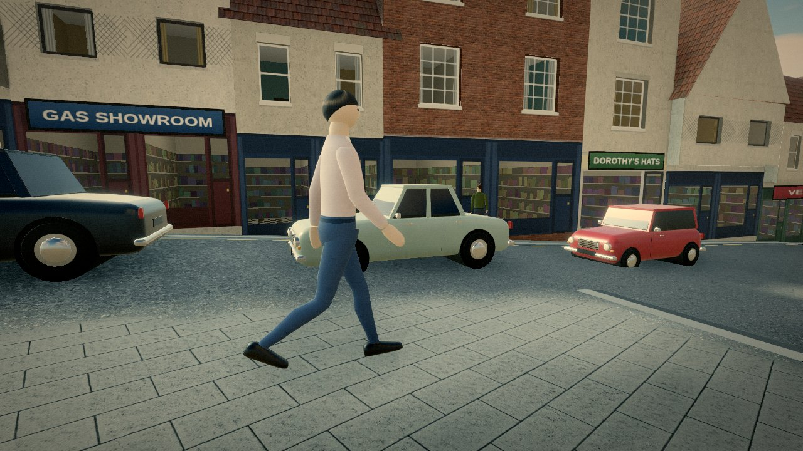
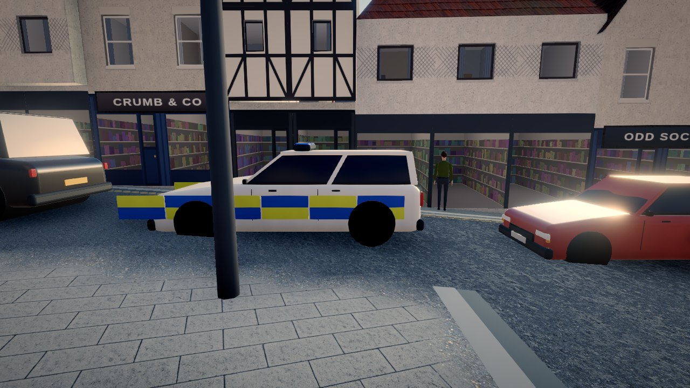
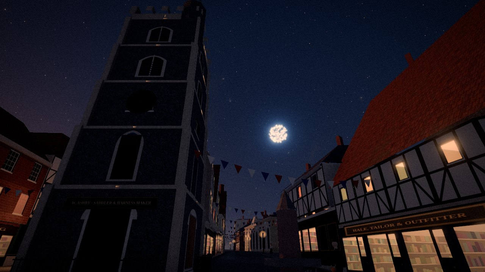
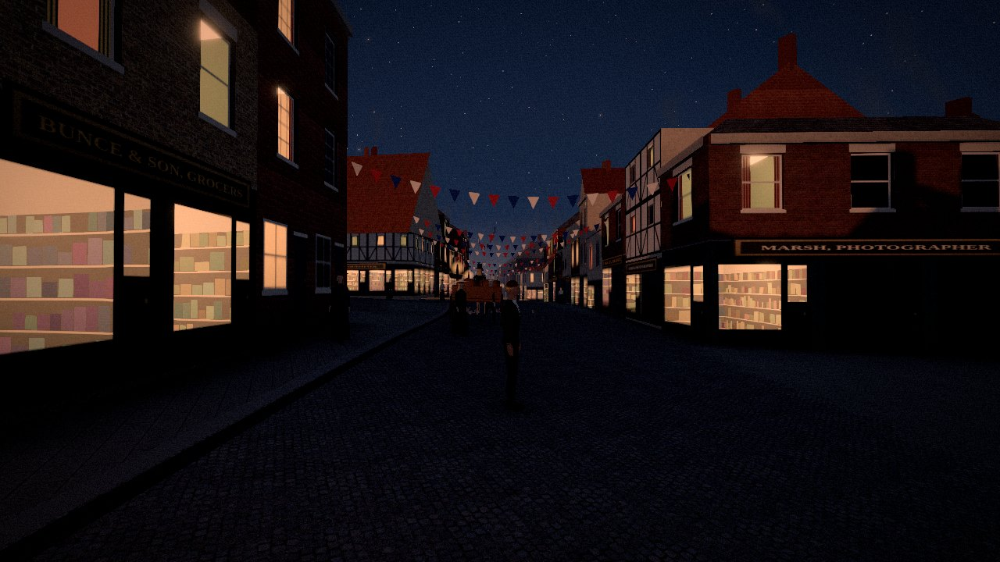
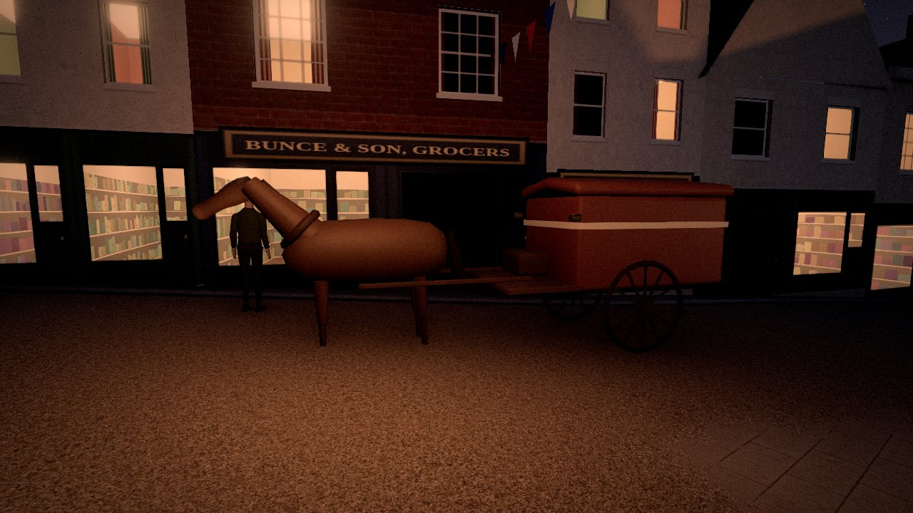

# CURFEW: St Albans Across Time (Milestone 1)

> **Also in this repository: [LAST SPACE: ST ALBANS](lastspace/README.md).** A playable 3D parking-space demolition derby on Bernard Street, Grange Street, Dalton Street and Church Street at 6.15 pm on a weekday. Eight drivers, one space fewer than drivers each round, solo or two-player split-screen. Open `lastspace/index.html`.


*Curfew* is an open-world game set in the centre of St Albans, Hertfordshire. You play it in the third person in a web browser. You can walk, ride, drive and get chased around a recognisable St Albans in three years:

- **2026**: Monday 5 October, 4.40 pm.
- **1964**: Saturday 10 October, market day.
- **1897**: Tuesday 22 June, Queen Victoria's Diamond Jubilee night.

You move between the years with the *Curfew Key*, a winding key from the Clock Tower's clock. What you do in the past changes the present.

This milestone covers the following:

- **The district**: the Clock Tower, French Row, Market Place, Chequer Street, upper St Peter's Street, the High Street, George Street, Waxhouse Gate, the Cathedral's west front and the Abbey Gateway, built in all three years.
- **The opening mission**, *Wind the Key*, which takes about 12 minutes.
- **Free roam**, with discoveries, postcard views and two small encounters.

The game runs on three.js in the browser with no build step. Everything it needs is inside the `game/` folder, and it makes no network calls while running.

### What it looks and sounds like

- **Rendering:**
  - Physically based materials lit by each year's own sky. The sun and moon positions are computed for the real date and time.
  - Post-processing: ambient occlusion (N8AO), bloom, a film-style colour grade, SMAA, and depth of field in conversations.
  - Four quality tiers with dynamic resolution.
- **Surfaces:**
  - Brick, stucco, render, clay tile, slate, York stone, setts, asphalt and grass are CC0 photo scans from Poly Haven, used at their real size and recoloured to each building's paint or brick.
  - The knapped flint of the Clock Tower is generated.
- **Windows:**
  - Every window is set back into the wall and has a room behind it, rendered by interior mapping: wallpaper, furniture, curtains, and shop shelves stocked in each shop's own colours.
  - By day the glass reflects the buildings across the street and the sky above their rooflines. On Jubilee night the lit rooms glow and the nearest gas lamps cast real light.
- **People:**
  - Smooth procedural humans, skinned on the GPU in instanced batches, with painted faces, strand-shaded hair, era clothing, dresses and frock coats.
  - Blended walk, run, idle, sitting, cycling and gesture animations. People turn their heads to look at you.
- **Vehicles:** rounded bodies with glass, rims, chrome, lamps and UK plates, from a 2026 police estate in Battenburg livery to a 1964 Mini and a spoked-wheel hansom cab.
- **Life:**
  - Branching trees with swaying leaf crowns, falling October leaves and chimney smoke.
  - Pigeons that scatter when you run at them.
  - Jubilee fireworks over 1897. Each burst lights the town, and its bang arrives late at the speed of sound.
- **Sound:**
  - An adaptive synthesised score: piano in 2026, guitar and walking bass in 1964, a parlour waltz in 1897, and a chase cue when the police are after you.
  - Street reverb, footsteps and era ambience.

All of it is made in code at load time except the surface scans. [`docs/ASSETS.md`](docs/ASSETS.md) lists every asset and licence.

| 2026 | 1964 | 1897 |
|---|---|---|
|  |  |  |
|  |  |  |

*The same French Row shop in 2026 before the mission, then after each choice in 1897:*

| Before | Fund returned to the Town Hall | Fund taken to the dinner |
|---|---|---|
|  |  |  |

*Close up:*

| People and plane trees, St Peter's Street, 2026 | Scanned flint, brick and paving, and windows reflecting the street, 2026 |
|---|---|
|  |  |
| **A conversation, with letterbox and depth of field, 1964** | **A Mini, a saloon and a police car on George Street, 1964** |
|  |  |
| **A police estate and a hatchback on George Street, 2026** | **Jubilee fireworks over the Clock Tower, 1897** |
|  |  |
| **Jubilee night on the High Street, 1897** | **A baker's cart under a gas lamp, 1897** |
|  |  |

More views, the whole mission beat by beat and the phone layout are in [`docs/screenshots/`](docs/screenshots/).

---

## Launching

### Desktop (Windows, macOS, Linux)

**Option A: double-click.** Open `game/index.html` in Chrome or Edge (tested from `file://` in Chromium) or Firefox. The game uses classic scripts and no fetches, so it works without a server.

**Option B: a local server (recommended).** Run one of these from the repository root, then open the address it prints:

```sh
python3 -m http.server 8080 --directory game     # then open http://localhost:8080
# or
npx serve game                                   # or: npx http-server game
```

### Android (Chrome)

Phones won't reliably open a local `index.html`, so serve the folder and open it over Wi-Fi:

1. On a computer on the same Wi-Fi, run `python3 -m http.server 8080 --directory game`.
2. Find the computer's local IP address, for example `192.168.1.20`.
3. On the phone, open Chrome and go to `http://192.168.1.20:8080`.
4. Rotate the phone to landscape. The game picks touch controls and Low quality automatically; you can change this under **Settings**.

There are two alternatives. You can copy the `game/` folder to the phone and serve it with an app such as Termux (`python -m http.server`). Or you can publish the folder on any static host, such as GitHub Pages.

### Saving

- Progress autosaves to the browser's `localStorage` at each checkpoint, each time jump and from the pause menu.
- If storage is blocked (private browsing, for example), the game still runs and says so.
- **Menu → Save code** shows a copyable code holding the whole game. Paste it into **Load a save code** on the title screen, on any device.

---

## Controls

| Action | Keyboard & mouse | Touch | Gamepad |
|---|---|---|---|
| Move / steer | W A S D or arrow keys | Left-side virtual stick | Left stick |
| Look | Click to lock the mouse (or drag) | Drag the right side of the screen | Right stick |
| Run | Hold Shift | Hold 🏃 Run | Hold B |
| Interact / skip a line | E | ✋ Use (appears when useful) | A |
| Get on or off a vehicle | F | 🚲 Ride / ⬇ Get off | Y |
| Wind the Curfew Key | Hold Q | Hold ⌛ Key | Hold X |
| Choose the year while winding | 1 / 2 or mouse wheel | Tap a year chip | D-pad |
| Accelerate / brake (vehicles) | W / S | Stick up / down | RT / LT |
| Handbrake | Space | ⛔ Brake | RB |
| Horn / bell | H | 📯 Horn | LB |
| Reset camera | C | (none) | Right-stick click |
| Map / journal / menu | M / J / Esc | 🗺 Map / ⏸ Menu | Back / Start |

### The Curfew Key: rules (the mission teaches these)

1. **Earshot.** The key only works where you can hear Gabriel, the Clock Tower bell. That means the district; it goes cold near the barriers at the edge of town.
2. **Steady hands.** Wind it on foot and standing still, with no police after you.
3. **Rest.** After a wind the key needs 45 s to recover, or 90 s after the long wind between 1897 and 2026.
4. **Pockets.** The key carries you, your clothes and your inventory, but never vehicles, animals or other people. Anything you leave behind stays in that year.
5. **Same place, safe ground.** You arrive on the same spot in the other year. If a wall, a parked van or oncoming traffic is there, you slip to the nearest safe ground and the game tells you why.
6. **Gabriel answers.** The bell tolls in both years.

---

## Feature status

| Area | Feature | Status |
|---|---|---|
| **District** | Street layout, junctions and building footprints from OpenStreetMap; real ground heights (George St slope, Abbey hill) | Done |
| | All named streets and landmarks in the brief, playable in 3 eras | Done |
| | Soft boundaries: era roadworks, fences, hurdles and fog, plus a "key goes cold" message | Done |
| | Interiors | Not started (doors are interaction points) |
| **Landmarks** | Clock Tower (stages, flint, battlements, turret, dial; 1897 saddler's sign and railings) | Done (simplified) |
| | Cathedral massing from OSM parts, west front, porches, Norman tower | Done (simplified) |
| | Abbey Gateway with walk-through arch; Waxhouse Gate and Christopher Inn passages | Done |
| | Town Hall with portico; Corn Exchange; Baptist spire; the Peahen corner across eras | Done |
| **Eras** | Era-specific buildings: Christopher Place / 1964 rubble car park / 1897 Gentle's Yard; Heritage Close / department store; plot subdivision | Done |
| | Shopfronts and signage per era (fictional names), lighting, fog, sky, colour grade | Done |
| | Street furniture per era (gas lamps, limes/planes, K6, Penfold box, Belisha beacons, market stalls, bunting) | Done |
| | Ambient sound per era (procedural: traffic, crowds, hooves, swifts, brass band, radio, pigeons), street reverb and footsteps | Done |
| | Adaptive synthesised score (era themes, chase cue, title theme) | Done |
| | Trees with leaf crowns, falling leaves, chimney smoke, pigeons, Jubilee fireworks | Done |
| **Rendering** | Physically based materials, scanned surfaces, image-based lighting from the era's sky, AO, bloom, colour grade, SMAA, quality tiers and dynamic resolution | Done |
| | Interior-mapped rooms behind every window, glass reflections, gas-lamp lights in 1897 | Done |
| **People** | Skinned procedural humans in instanced batches, with faces, hair, era clothing and blended animation; they gawp at anachronisms and get comically knocked down | Done |
| | Story characters with subtitles for every line and a cinematic conversation camera | Done (no recorded voices) |
| **Vehicles** | 2026 hatchback/estate/SUV/van/taxi/bus; 1964 saloons/small car/bakery van/green bus/scooter; 1897 safety bicycle, baker's cart, hansom, dray, all with rounded bodies, glass, rims and lamps | Done |
| | Enter/exit, arcade handling with real slopes, collisions | Done |
| | Simple AI traffic that keeps left, stops for people, honks | Done |
| **Police** | Wanted level that escalates and can be escaped; per-era units (2026 patrol cars and officers; 1964 constables, Noddy bike, bell car; 1897 City Police constables, whistles, sergeant on a bicycle) | Done (basic AI) |
| **Time travel** | Curfew Key: winding, rules, rest timer, era picker, playable "time wave" transition, safe-arrival slips | Done |
| **Mission** | *Wind the Key*: 2026 → 1964 → 1897 → 2026, cross-era clue, cart chase with City Police, in-world choice | Done |
| | Consequence flags persist through save/reload; visible in 1964 and 2026 (shopfront, occupant, plaque, lamp, newspaper, phone call) | Done |
| **Free roam** | Discoveries in each era; postcard views of 5 landmarks in 3 eras; 1897 greased pig; 1964 scooter sprint; wardrobe at the Clock Tower | Done |
| **UI** | HUD (era, objective + distance, minimap, key ring, wanted stars, prompts), full map, journal, settings, save codes | Done |
| | Touch controls (dynamic stick, camera drag, contextual buttons); gamepad | Done |
| **Performance** | Instanced characters/vehicles/props, chunked merged buildings, fog distance, Low/Medium/High presets (Low on touch devices: no shadows, pixel ratio 1, half-size ground paint) | Partial: budgets measured (phone preset 57–107 draw calls, ≤ 378k triangles, ~81 MB textures); not yet profiled on a real phone |
| **Testing** | Headless checks (`tools/verify.js`), a full playthrough of both endings (`tools/playthrough.js`), a performance report (`tools/perf.js`) and documentation screenshots (`tools/screens.js`) | Done (see [`docs/VERIFICATION.md`](docs/VERIFICATION.md)) |

## Documentation

- [`docs/DESIGN.md`](docs/DESIGN.md): the one-page design note, written before building.
- [`docs/RESEARCH.md`](docs/RESEARCH.md): sources, the reasons for each year, and every feature marked documented, inferred or invented.
- [`docs/KNOWN_ISSUES.md`](docs/KNOWN_ISSUES.md): known issues and a prioritised list of next steps.
- [`docs/VERIFICATION.md`](docs/VERIFICATION.md): the test checklist, results and screenshots.
- [`docs/ASSETS.md`](docs/ASSETS.md): the scanned textures, libraries and their licences.

## Running the checks (developers)

The game itself needs nothing installed. The test tools need Node.js 18+ and Playwright's Chromium:

```sh
npm install playwright        # once; or use an existing global install
npx playwright install chromium
node tools/verify.js out/verify             # checklist: movement, camera, vehicles, jumps, police, saves, touch, file://
node tools/playthrough.js out/play returned # the whole opening mission, Town Hall ending
node tools/playthrough.js out/play dinner   # ... and the Corn Exchange ending
node tools/perf.js out/perf                 # draw calls, triangles, memory, simulation cost per era
node tools/screens.js out/screens           # the screenshots in docs/screenshots
```

They run the game in headless Chromium with software WebGL, which is far too slow to play in real time, so they advance the game with `SA.debug.sim()` and take screenshots between steps.

`node tools/build-artifact.js out/artifact` packages the game as a page for publishing as a claude.ai Artifact. The page is the body of `index.html` with the stylesheet inlined, and the scripts are published beside it. In that viewer, a game in progress survives a republish of the page.

## Repository layout

```
game/                 the runnable game (open index.html)
  index.html, css/, js/ (core, world, entities, game, ui, data), vendor/three.min.js
docs/                 design note, research notes, known issues, verification + screenshots
tools/                developer-only tools (map pipeline, texture pack, three.js vendoring, headless checks, playthrough, perf, screenshots)
dist/                 curfew-st-albans-m1.zip (the game folder plus docs)
```

## Credits and licences

- **Map data** © OpenStreetMap contributors, ODbL 1.0 (openstreetmap.org/copyright). The processed extract is `game/js/data/mapdata.js`; the raw extract is `tools/data/district.osm.gz`.
- **Terrain** is derived from the Mapzen/AWS Terrain Tiles, which include UK Environment Agency LIDAR (Open Government Licence) and SRTM.
- **three.js** (MIT), **postprocessing** (Zlib) and **N8AO** (CC0) are bundled in `game/vendor/`.
- **Surface textures** are CC0 photo scans from Poly Haven (polyhaven.com), credited in [`docs/ASSETS.md`](docs/ASSETS.md). `tools/fetch_textures.py` rebuilds the pack.
- Everything else (people, vehicles, trees, signs, sounds and music) is generated in code.
- All characters and businesses are fictional.
