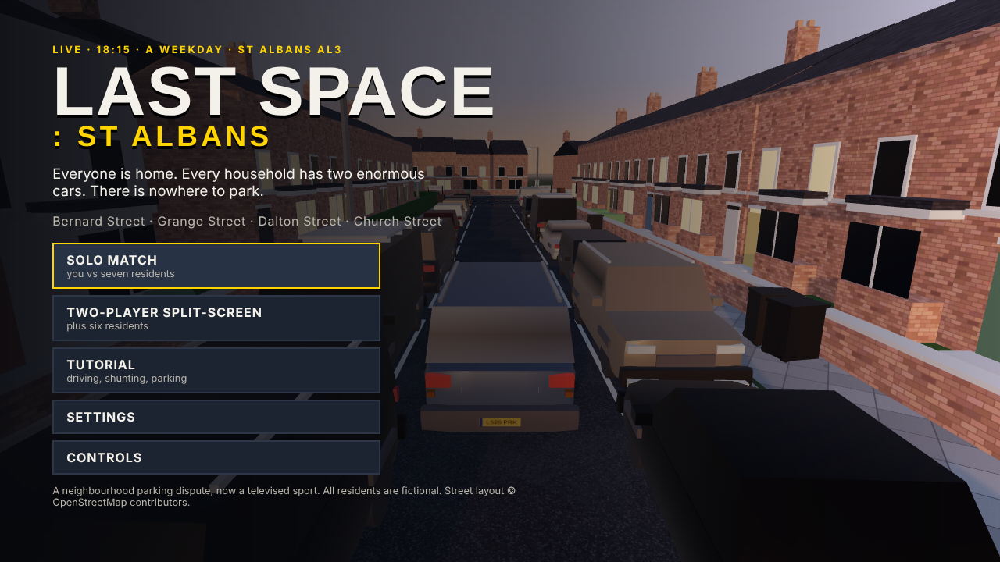
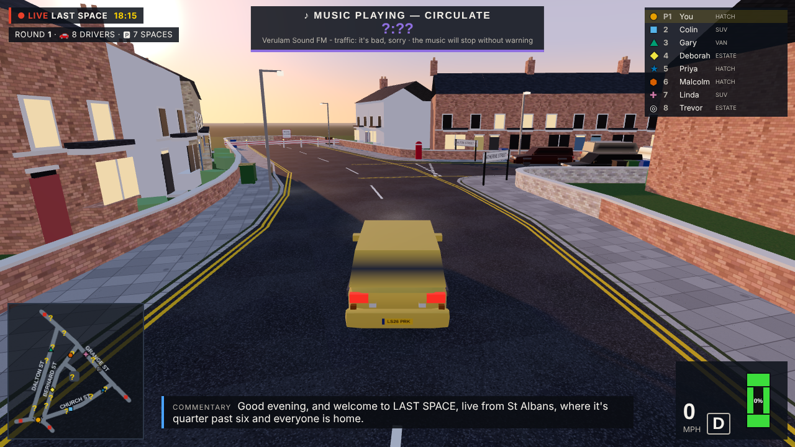
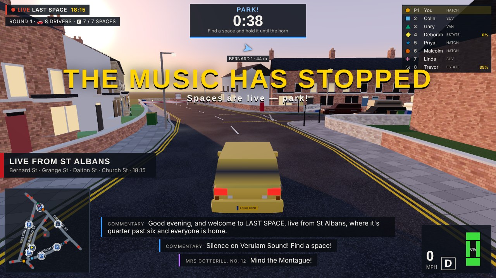
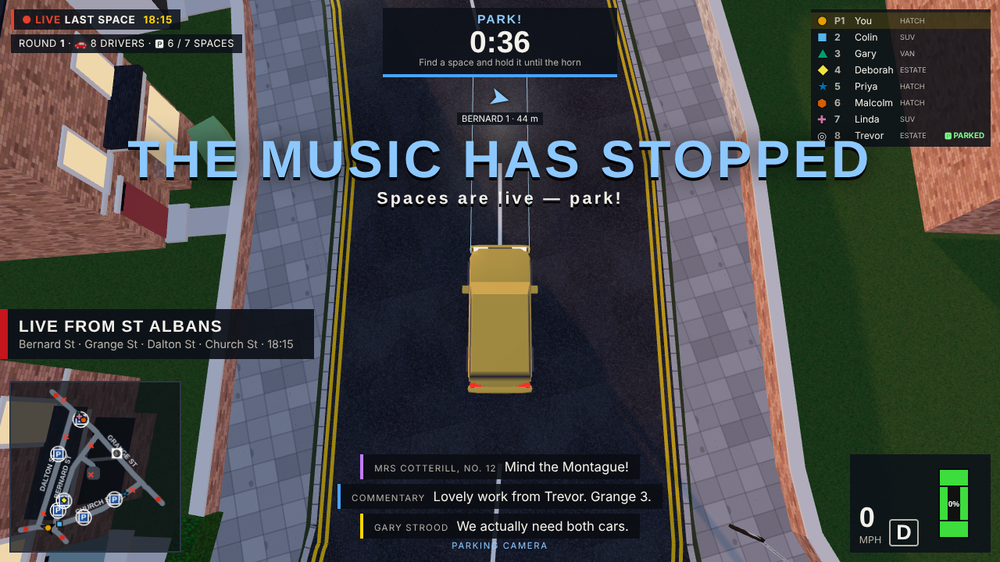
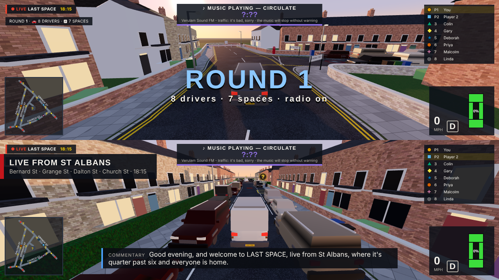
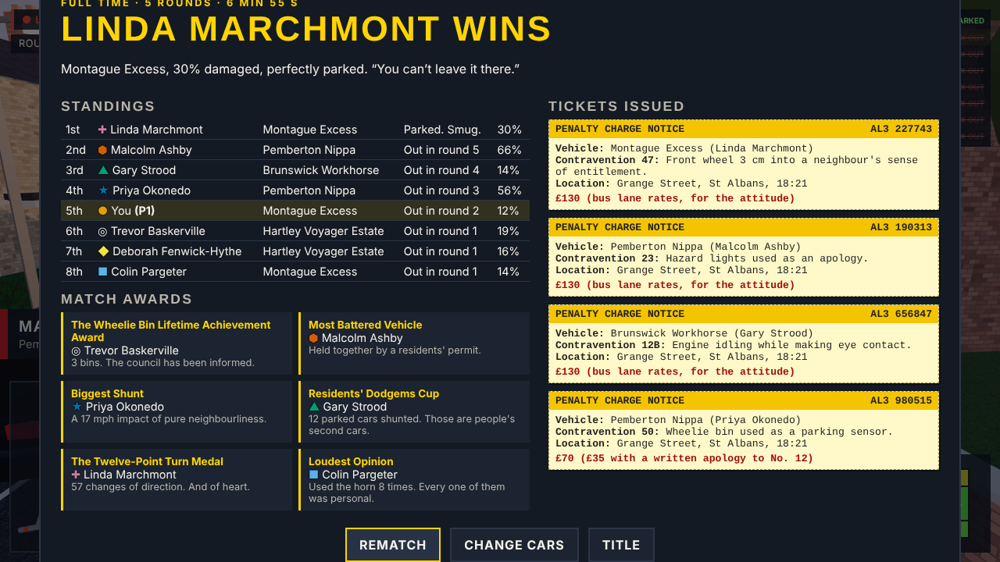

# LAST SPACE: ST ALBANS

*It is 6.15 pm on a weekday. Everyone has come home. Every household seems to own two enormous cars. There is nowhere to park.*

A 3D racing and demolition game set on Bernard Street, Grange Street, Dalton Street and Church Street in St Albans, played as a televised neighbourhood parking dispute. Eight drivers fight over one fewer space than there are drivers, round after round, until two cars fight over the last space on the street.

The game runs in a web browser (three.js, WebGL, no build step). Everything is generated in code: the streets, terraces, cars, sounds, music and commentary.

| | |
|---|---|
|  |  |
|  |  |
|  |  |

## Playing it

- **Open `index.html`** in Chrome, Edge, Firefox or Safari. It works straight from the file system (classic scripts, no fetches). For a single file, use `dist/last-space-st-albans.html`, which is the whole game inlined into one page.
- Or serve the folder: `python3 -m http.server 8080 --directory lastspace`, then open `http://localhost:8080`.
- The title screen runs a live bot match in the background. Choose **Solo match**, **Two-player split-screen** or **Tutorial**.

### Controls

| Action | Solo keyboard | Split-screen P1 | Split-screen P2 | Gamepad |
|---|---|---|---|---|
| Accelerate | W / ↑ | W | ↑ | RT |
| Brake, then hold to reverse | S / ↓ | S | ↓ | LT |
| Steer | A D / ← → | A D | ← → | Left stick |
| Handbrake | Space | Space | `/` or Num 0 | A |
| Horn | H or Q | Q | `.` or Enter | B |
| Parking camera (toggle) | C or E | E | `,` or Num 1 | Y |
| Look behind (hold) | F or B | F | K or Num 3 | RB |
| Recover when stuck or overturned (hold) | R | R | L or Num 2 | X |
| Pause | Esc or P | | | Start |

With one gamepad in split-screen, player 2 uses the pad and player 1 the keyboard. Menus work with the mouse, keyboard (Tab/Enter) or a gamepad (D-pad and A). Tab cycles the camera between surviving drivers once you are out.

## The match

1. **Eight drivers, seven spaces.** You plus seven residents (or two players plus six).
2. **Circulation.** Jaunty local radio plays (*Verulam Sound FM*) for an unpredictable 20–35 seconds. Yellow **?** markers on the road and minimap show where spaces *might* appear, always more of them than will go live.
3. **The music stops.** It cuts out with a tape-stop. Some of the **?** spaces go live, marked with blue diagonal stripes, a **P** sign with a label (for example `GRANGE 6`), a light beacon above the rooftops and an icon on the minimap. The rest are marked **SUSPENDED** with red cross-hatching. Live spaces are chosen away from where cars are at that moment and spread around the neighbourhood, so you can't just sit on one.
4. **45-second parking battle.** Park and hold it. A valid park needs:
   - the car's whole footprint inside the painted rectangle (its physics box, the same one that collides);
   - the car facing along the space within 15°, either way round;
   - the car upright and below walking pace (1.5 m/s) for **2 seconds**.

   A progress ring fills, then **PARKED — HOLD YOUR POSITION**. The HUD says what is wrong ("Outside the lines (34 cm)", "Straighten up", "Too fast", "Space taken").
5. **Parked is not safe.** Nothing locks you in. Get shoved over the line, spun out of alignment or knocked onto the pavement and you lose it. Occupancy is worked out from geometry every tick, never from who touched the space first, and only one car can hold a space.
6. **The horn.** Parked drivers survive and everyone else is out. If several drivers fail to park, they are all out. The next round has one space fewer than there are survivors. The final is two drivers and one space, and it prefers a space on Grange Street.
7. **Sudden death.** If nobody is parked at the horn, the first driver to complete a valid **3-second** park wins the match. Extra spaces open every 20 seconds, and a 100-second stalemate guard awards the win to whoever came closest, "on a technicality".
8. **Finale.** A slow-motion freeze-frame of the winner's battered car, perfectly parked. A neighbour says "You can't leave it there." Then the results: standings, sarcastic match awards, and a penalty charge notice for everyone.

## The neighbourhood: what is real and what is not

The street layout comes from **OpenStreetMap** (© OpenStreetMap contributors, ODbL). The extract was fetched on 2026-10-07 and is stored in `tools/data/stalbans_grange.osm.gz`. `tools/build_map.py` turns it into `js/data/mapdata.js`. I checked these relationships against that data before building:

| Street | OSM ways | What the data says (and the game keeps) |
|---|---|---|
| **Dalton Street** | 151687980 | Runs from Catherine Street north-north-east to Grange Street (≈265 m). Two-way. |
| **Bernard Street** | 1230246222, 1230246221, 151687985 | Runs from Catherine Street north to Grange Street (≈234 m), roughly parallel to Dalton Street. One-way northbound above the Church Street junction. Speed cushions at OSM nodes 1792033842 and 8960273545. |
| **Church Street** | 151687982, 1230246220 | Runs from Grange Street west-south-west to the foot of Bernard Street (≈211 m). One-way in that direction. Traffic-calming choker near the Bernard Street end (node 1645283873). The Jubilee Centre (way 164349081) is on its south side. |
| **Grange Street** | 151687981 | Runs diagonally north-west from St Peter's Street, past Church Street, Bernard Street and Dalton Street. Speed cushions at nodes 11409057408 and 11409057413. |
| **Catherine Street** | 944862658, 3997174 | The main road along the south that closes the western loop between Dalton Street and Bernard Street. |

Junctions are the shared OSM nodes (for example Dalton/Grange is node 60663824, Bernard/Grange 60663825, Church/Grange 60663826). This gives a compact figure-of-eight: Dalton–Grange–Bernard–Catherine on the west, Bernard–Grange–Church on the east. You can always escape a lost fight down another street. The real residents' car park off Bernard Street (way 167866271, drive 167866262) is in as **Grange Court**, with perpendicular bays. The pillar box on the corner of Dalton Street (node 20959945, ref AL3 25) and the 20 mph limit (painted as roundels) are from the same data.

**Deliberate compromises:**

- Carriageways are slightly wider than real life (8.3–9.4 m kerb to kerb) so eight cars can fight. The car park is about 2 m roomier than the real one so an SUV can use it.
- The streets stop at road-closed barriers a short way past the four named streets: Grange Street toward St Peter's Street and past Dalton Street, and Catherine Street either side. That keeps the arena compact.
- One-way signs and No Entry signs are shown at the right ends, but nobody obeys them, which is rather the point.
- The houses are **procedural** terraces (red brick, yellow stock brick, painted render) placed along the real frontages with bay windows, front gardens and garden walls. They are not surveyed individual buildings. House numbers are invented.
- Street-name signs are larger than real ones so you can read them at speed.

## The cars

| | Small hatchback | Family estate | Luxury SUV | Tradesperson's van |
|---|---|---|---|---|
| Fictional model | Pemberton Nippa | Hartley Voyager Estate | Montague Excess | Brunswick Workhorse |
| Size | 3.95 × 1.75 m | 4.82 × 1.85 m | 5.05 × 2.00 m | 5.20 × 2.00 m |
| Mass | 1100 kg | 1580 kg | 2450 kg | 2300 kg |
| Turning circle radius | ≈3.0 m | ≈4.2 m | ≈5.5 m | ≈5.3 m |
| Strengths | Best acceleration, tightest turning, quickest steering and gear changes; fits every space with room to spare | Balanced | Strong launch force, rams hardest, durable | Most durable, heavy |
| Costs | Gets shoved about by everything | Long body: tight spaces are fiddly | Wide turning circle, slow steering, hardest to park | No rear window: no parking-camera guide lines when reversing and a blacked-out look-back view. Slow reversing, and a 0.55 s pause changing between forward and reverse |

The residents' parked cars include an even larger "implausibly large" SUV class, some of them half on the pavement or sticking out into the road.

## How it works

- **Rigid-body physics** (`js/sim/physics.js`): a 2D solver on the road plane. Cars, residents' cars, wheelie bins, debris and walls are oriented boxes and circles. Contacts come from SAT with reference-face clipping (after Box2D Lite) and are resolved with sequential impulses, warm starting, Coulomb friction and restitution. The outcome of an impact falls out of mass, inertia, speed, angle and contact point. Nothing is a canned bounce.
- **Tyres** (`js/sim/vehicles.js`): each axle cancels sideways slip up to its grip limit (μ·N), and shares grip with braking. A heavy car therefore resists being shoved sideways, a light one doesn't, and the handbrake lets the rear go. Kerbs resist slow sideways shoves, so you get pinned against them, but you mount them square-on or at speed. Cars can overturn from big side impacts or being tripped over a kerb.
- **Damage**: zone damage (front, rear, left, right) from each impact's velocity change, divided by durability. It moderately pulls the steering, reduces lock, power and top speed. Panels dent, scraped paint shows bare metal, bumpers fall off as physical debris, and lights break. There are sparks, tyre smoke, glass and bits of car, plus impact sounds scaled to severity.
- **Recovery**: hold the recover button when overturned or genuinely wedged (2.5 s of pushing without moving). It takes 1.6 s (2.4 s in the van), and you are vulnerable while it happens. You are then put back on the nearest clear stretch of road that is **at least a metre clear of every scoring space**.
- **Bots** (`js/sim/bots.js`) drive the same `Car` through the same inputs a player has, under the same parking rules. They only know what players know: **?** markers before the music stops, live spaces after. They plan routes on the street graph, avoiding turning round mid-street. They pull past and reverse into parallel spaces, nose or reverse into bays, and shuffle to straighten up. They squeeze round badly parked SUVs, back off in stand-offs, recover from crashes, and switch target when a space is taken or blocked.
  - **nearest** (Deborah, Malcolm): goes for the closest live space.
  - **bully** (Gary in the van, Linda in an SUV): rams vulnerable parked cars out of their spaces once spaces are scarce or time is short, then takes the space.
  - **quiet** (Priya, Trevor): avoids contested spaces and busy streets.
  - **confident** (Colin's luxury SUV, Sandra): barges through other cars and goes for wide spaces.
- **Commentary and remarks** (`js/sim/remarks.js`, `js/data/text.js`): event-driven lines from a TV commentator, the drivers and the neighbours (named by house number). Examples: "That's directly outside my house.", "We actually need both cars.", "I was indicating.", "The permit doesn't guarantee a space.", "I'm putting this on the residents' group." Each channel is rate-limited and recent lines are not repeated. Optional speech synthesis reads the neighbours' lines aloud.
- **Accessibility**: drivers have a colour *and* a shape *and* a number (●■▲◆★⬢✚◎). Space states use pattern (stripes or cross-hatch), icons (? / P / ✕), labels and colour. Camera shake can be turned off. There is a larger-text HUD option, and split-screen can be stacked or side by side.

## Verification

The simulation runs headless in Node (`tools/sim.js`) and the full game in headless Chromium (`tools/browser-*.js`). Results from this build are in [`docs/VERIFICATION.md`](docs/VERIFICATION.md). In summary:

- **A complete match can be played and restarted without getting stuck.** Twelve eight-bot matches all reached the results screen. A full browser match with the player on autopilot reached results with no console errors, as did solo, split-screen and the tutorial.
- **Every vehicle can physically fit every scoring space.** This is checked both geometrically (smallest margin 0.45 m, van and SUV in the "small" space) and by bots actually parking each of the four vehicles in each of the 26 spaces.
- **Parking detection holds up during collisions.** A gentle nudge keeps the park, and a 12 m/s SUV side ram dislodges it. Parks fail when 23° off the kerb line, when overhanging the end line, or when driving through at speed.
- **Impacts depend on mass, direction and speed.** An SUV T-boning a hatch shoves it 6.2 m, but the reverse moves the SUV only 0.7 m. Tripling the speed shoves 9× further and does about 20× the damage. A rear-corner hit spins the victim 59° where a centre hit does not. A head-on at 9 + 9 m/s stops both cars dead, wrecks the fronts and knocks the bumpers off.
- **Bots park and win.** Bots parked 194 of 208 solo trials (four vehicles, 26 spaces, two starts each). In the 12-match run the winners covered all four personalities (nearest, quiet, confident, bully) and three vehicles. The van won in earlier runs but not in this set.

Run them yourself (Node 18+; the browser checks need Playwright's Chromium):

```sh
node tools/sim.js --fit --park --rules --impacts --match 12
node tools/browser-check.js out/check          # boot, solo, split-screen, tutorial screenshots
node tools/browser-match.js out/match hatch    # a whole match in the browser, to the results screen
node tools/browser-tutorial.js out/tutorial    # the tutorial, every step
node tools/build-single.js                     # dist/last-space-st-albans.html
python3 tools/build_map.py                     # regenerate js/data/mapdata.js from the OSM extract
```

## Known limitations and next steps

- **Match length.** Bot-only matches in testing took 2.5–7.1 minutes (mean 4.2). That's a little shorter than the 5–8 minute target, because bots still fail to park in about a third of round-one spaces. With people driving, the length depends on how well they park. Better bot congestion handling would lengthen matches without changing the rules.
- **Bots and the car park.** Perpendicular bays in the small Grange Court car park are hard for the SUV and van bots (about half their attempts succeed), so the bots weight against them. Humans find them easier.
- **Cars are low-poly procedural models.** Dents are vertex displacement, not a full soft-body simulation.
- **Physics is 2D on the road plane.** Kerbs, speed cushions, body roll, pitch and overturning are modelled on top, but cars can't climb on each other.
- **Online multiplayer** is a later milestone. The fixed-step simulation is deterministic per seed, which is a good basis for lockstep or rollback networking.
- **Performance** was checked in software-rendered headless Chromium only. Not yet profiled on low-end laptops or phones, and there are no touch controls yet.

## Layout

```
index.html, css/        the page and its styles
js/core                 namespace, utilities, input
js/data                 OSM-derived map data, the pool of scoring spaces, all the words
js/sim                  physics, arena, vehicles, parking rules, bots, remarks, the match (no three.js; runs in Node)
js/render               textures, car models, the neighbourhood, effects, cameras
js/ui, js/game          HUD, menus, tutorial
js/audio                synthesised music, engines, crashes, horns, voices
vendor/                 three.js r186 (MIT), bundled once as a classic script
tools/                  map pipeline, headless tests, single-file build
dist/                   the single-file build
```

All drivers, neighbours, vehicles, businesses, radio stations and tickets are fictional.
